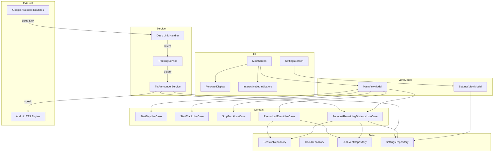

# Доработка: Голосовые команды, LED-индикаторы и прогноз остаточного пробега

## Описание и цель

**FigaGo** помогает человеку на инвалидной коляске с электрической тягой **не остаться без заряда посреди города**.

Приложение собирает статистику погасания индикаторов заряда батареи коляски и фактического пробега на каждом уровне заряда. На основе этих данных приложение **прогнозирует остаточный пробег** — главную метрику, ради которой и создан проект.

В рамках данной доработки:
1. Настройка голосовых команд через **Google Assistant Routines**
2. Цветовая дифференциация и увеличение LED-индикаторов
3. Интерактивные кликабельные индикаторы с каскадной логикой
4. **Прогнозный остаточный пробег** — новая ключевая метрика на главном экране
5. **Экран настроек** с сохранением параметров
6. **Голосовые TTS-оповещения** — озвучка пробега и остатка по расстоянию, по времени или по запросу

---

## 1. Голосовые команды (Google Assistant Routines)

### Подход: Routines + инструкция для пользователя

Вместо App Actions (требует верификации в Google Console) используем **Google Assistant Routines** — пользователь один раз настраивает фразы в приложении Google Home, а приложение FigaGo принимает Intent-ы.

### Настройка по умолчанию
При первом запуске (или на экране настроек) показываем пользователю **пошаговую инструкцию** по настройке Routines:

```
1. Откройте приложение Google Home
2. Настройки → Google Assistant → Routines
3. Создайте routine:
   - Фраза: «Я поехал»
   - Действие: «Открыть приложение FigaGo» (с deep link)
```

### Deep Links для команд

| Фраза пользователя        | Deep Link URI                      | Действие в приложении |
|---------------------------|------------------------------------|-----------------------|
| «ОК Гугл, я поехал»       | `figago://command/start_track`     | StartDay (если нужно) + StartTrack |
| «ОК Гугл, я остановился»  | `figago://command/stop_track`      | StopTrack |
| «Лампочка»                | `figago://command/led_event`       | Погасить один индикатор |
| «ОК Гугл, какой пробег»   | `figago://command/announce_status` | Озвучить пробег и прогноз остатка |

### 1.1 «Я поехал» → Старт трека

**Поведение:**
- `DayState.IDLE` → автоматически `StartDay` → затем `StartTrack`
- `DayState.PAUSED` → только `StartTrack`
- `DayState.RECORDING` → игнорируем, вибрация «уже записываю»

### 1.2 «Я остановился» → Стоп трека

**Поведение:**
- `DayState.RECORDING` → `StopTrack`, сессия остаётся открытой
- Иначе → игнорируем

### 1.3 «Лампочка» → Погасить индикатор

Существующая логика — декремент `ledCount` на 1.

### 1.4 «Какой пробег» → Озвучить статус

**Поведение:**
- Если есть активная сессия — через **Android TTS** озвучивает:
  `«Пробег двенадцать целых четыре десятых километра. Осталось примерно восемь целых два десятых километра»`
- Если прогноз отсутствует — озвучивает только пробег
- Если сессии нет — `«Сессия не начата»`
- Работает **всегда**, независимо от настроек автоматических оповещений

### Затрагиваемые компоненты

| Файл | Изменение |
|------|-----------|
| [AndroidManifest.xml](file:///c:/FigaGo/app/src/main/AndroidManifest.xml) | Добавить `<intent-filter>` с deep link схемой `figago://` |
| [MainActivity.kt](file:///c:/FigaGo/app/src/main/java/com/figago/ui/MainActivity.kt) | Обработка `intent.data` при запуске через deep link |
| [TrackingService.kt](file:///c:/FigaGo/app/src/main/java/com/figago/service/TrackingService.kt) | Новый action `ACTION_VOICE_START_TRACK` (StartDay + StartTrack) |
| [shortcuts.xml](file:///c:/FigaGo/app/src/main/res/xml/shortcuts.xml) | Обновить shortcut-ы с deep link-ами |

---

## 2. Цветовая дифференциация LED-индикаторов

### Текущее состояние
Все 5 индикаторов — одинаковый цвет (`MaterialTheme.colorScheme.secondary`), размер 24dp/20dp.

### Новая схема цветов (слева направо)

| Позиция | Цвет (активный)       | Hex       | Семантика |
|---------|----------------------|-----------|-----------|
| 1       | 🔴 Красный            | `#E53935` | Критический заряд |
| 2       | 🟠 Оранжевый          | `#FB8C00` | Низкий заряд |
| 3       | 🟠 Оранжевый          | `#FB8C00` | Средний заряд |
| 4       | 🟢 Зелёный            | `#43A047` | Хороший заряд |
| 5       | 🟢 Зелёный            | `#43A047` | Полный заряд |

- Неактивный (погашенный) → серый `onSurface.copy(alpha = 0.15f)`

### Увеличение размеров

| Состояние | Было  | Стало  |
|-----------|-------|--------|
| Активный  | 24dp  | **40dp** |
| Неактивный| 20dp  | **32dp** |

Использовать иконку `Icons.Filled.Battery` или вертикальный прямоугольник со скруглением — визуально ближе к индикатору батареи.

### Затрагиваемые компоненты

| Файл | Изменение |
|------|-----------|
| [MainScreen.kt](file:///c:/FigaGo/app/src/main/java/com/figago/ui/main/MainScreen.kt) | Компонент `LedIndicators` → массив цветов, увеличенные размеры |

---

## 3. Интерактивные кликабельные индикаторы

### Замена кнопки «Лампочка»
Кнопка «Лампочка» из `ControlPanel` **удаляется**. Пользователь нажимает непосредственно на значки.

### Каскадная логика

**Погасить (нажатие на горящий индикатор N):**
```
Гаснут: N, N+1, N+2, ... 5
ledCount = N - 1
```
> Пример: горят все 5, нажали на 3-й → гаснут 3, 4, 5 → `ledCount = 2`

**Зажечь (нажатие на потухший индикатор N):**
```
Загораются: 1, 2, ... N
ledCount = N
```
> Пример: горит только 1-й, нажали на 4-й → загораются 1, 2, 3, 4 → `ledCount = 4`

### Визуальная анимация
Последовательная анимация зажигания/затухания с задержкой **100мс** между значками для визуальной обратной связи.

### Запись LED-событий
При каскадном изменении записывается **одно событие** с итоговым `ledCount`, а не серия.
Поле `distanceAtEvent` фиксирует пробег на момент изменения — это критически важно для прогнозирования.

### Затрагиваемые компоненты

| Файл | Изменение |
|------|-----------|
| [MainScreen.kt](file:///c:/FigaGo/app/src/main/java/com/figago/ui/main/MainScreen.kt) | Новый `InteractiveLedIndicators` с `onClick` на каждом, удаление кнопки «Лампочка» |
| [MainViewModel.kt](file:///c:/FigaGo/app/src/main/java/com/figago/ui/main/MainViewModel.kt) | Метод `setLedCount(count: Int)` |
| [RecordLedEventUseCase.kt](file:///c:/FigaGo/app/src/main/java/com/figago/domain/usecase/RecordLedEventUseCase.kt) | Перегрузка `invoke(targetLedCount: Int)` |
| [TrackingService.kt](file:///c:/FigaGo/app/src/main/java/com/figago/service/TrackingService.kt) | `ACTION_SET_LED_COUNT` + extra `EXTRA_LED_COUNT` |

---

## 4. Прогнозный остаточный пробег ⭐ (ключевая фича)

### Концепция

Это **главная ценность приложения**. Пользователь на электрической коляске видит на экране:

```
┌──────────────────────┐
│      12.4 км         │  ← фактический пробег
│       км             │
│                      │
│   ≈ 8.2 км осталось  │  ← ПРОГНОЗНЫЙ ОСТАТОК
│   🔴 🟠 ⚪ ⚪ ⚪       │  ← 2 из 5 горят
└──────────────────────┘
```

### Алгоритм расчёта прогноза

> [!IMPORTANT]
> **Разряд батареи коляски нелинейный!** Первый индикатор (полная батарея) может гореть 15–20 км,
> а последний — всего 2–3 км. Алгоритм учитывает каждый уровень **индивидуально**.

#### Начальные значения (без статистики)
Если статистики мало (< 3 сессий), используются **значения по умолчанию** из настроек.
Значения по умолчанию подобраны для типичной электрической коляски (~35 км полного хода):

| Уровень (горящих) | Пробег на уровне | Остаток при этом уровне | Комментарий |
|:-:|:-:|:-:|---|
| 5 (полный) | 15 км | **35 км** | Первый индикатор горит дольше всех |
| 4 | 8 км | **20 км** | Расход ускоряется |
| 3 | 6 км | **12 км** | Средний расход |
| 2 | 4 км | **6 км** | Ускоренный расход |
| 1 (критический) | 2 км | **2 км** | Минимальный остаток |
| 0 | — | **0 км** | Батарея разряжена |

Пользователь настраивает **каждый уровень отдельно** в настройках (Секция «Батарея и прогноз»).

#### Расчёт с учётом статистики (≥ 3 сессий)
На основе собранных `LedEvent` — **каждый уровень рассчитывается индивидуально**:

```
Для каждого уровня N (от 5 до 1):
    средний_пробег_на_уровне[N] = AVG(distance_при_переходе_с_N_на_N-1)
    // НЕ линейная формула! Каждый уровень имеет свой средний.

прогноз_остатка_при_К_горящих = SUM(средний_пробег_на_уровне[i], i = K..1)
```

**Пример реальной нелинейной статистики:**

| Сессия | 5→4 (км) | 4→3 (км) | 3→2 (км) | 2→1 (км) | 1→0 (км) | Полный пробег |
|--------|:--------:|:--------:|:--------:|:--------:|:--------:|:-------------:|
| День 1 | 16.2     | 8.1      | 5.8      | 3.5      | 1.9      | 35.5 км       |
| День 2 | 14.8     | 7.5      | 6.2      | 4.0      | 2.5      | 35.0 км       |
| День 3 | 15.5     | 8.3      | 5.5      | 3.8      | 2.1      | 35.2 км       |
| **Ср.** | **15.50** | **7.97** | **5.83** | **3.77** | **2.17** | **35.23**    |

> Обратите внимание: 5→4 даёт **15.5 км** (43% всего пробега), а 1→0 всего **2.17 км** (6%).
> Линейная модель (7 км на уровень) была бы совершенно неточной.

**Прогноз при ledCount=3:** `5.83 + 3.77 + 2.17 = 11.77 км`
**Прогноз при ledCount=1:** `2.17 км` (критический!)

#### Уменьшение прогноза с ростом пробега
Прогноз не статичен — он уменьшается по мере езды **внутри текущего уровня заряда**:

```kotlin
// Пробег с момента последнего переключения индикатора
val distanceSinceLastLedChange = currentTotalDistance - distanceAtLastLedEvent

// Средний пробег на текущем уровне (по статистике или из настроек)
val avgDistanceForCurrentLevel = getAvgDistanceForLevel(currentLedCount)

// Оставшийся пробег на текущем уровне
val remainingOnCurrentLevel = max(0, avgDistanceForCurrentLevel - distanceSinceLastLedChange)

// Прогноз = оставшееся на текущем уровне + сумма средних для нижних уровней
val forecast = remainingOnCurrentLevel + sumOfAvgForLevelsBelow(currentLedCount)
```

### Новый UseCase: `ForecastRemainingDistanceUseCase`

```kotlin
class ForecastRemainingDistanceUseCase @Inject constructor(
    private val ledEventRepository: LedEventRepository,
    private val sessionRepository: SessionRepository,
    private val settingsRepository: SettingsRepository,  // НОВЫЙ
) {
    /**
     * Возвращает прогнозный остаточный пробег (км) или null если данных нет.
     *
     * @param currentLedCount текущее количество горящих индикаторов
     * @param currentTotalDistance текущий суммарный пробег за день (метры)
     * @param distanceAtLastLedEvent пробег на момент последнего переключения (метры)
     */
    suspend operator fun invoke(
        currentLedCount: Int,
        currentTotalDistance: Double,
        distanceAtLastLedEvent: Double,
    ): Double? { ... }
}
```

### Отображение на UI

Новый блок `ForecastDisplay` на главном экране **между** индикаторами и дистанцией:

```
[Статус-карточка]
[LED-индикаторы 🔴🟠🟠🟢🟢]
[≈ 18.5 км осталось]        ← НОВЫЙ БЛОК
[      12.4 км     ]
[      Старт / Стоп       ]
```

- Шрифт: 28sp, `FontWeight.Medium`
- Цвет зависит от остатка:
  - `≥ 10 км` → зелёный `#43A047`
  - `5..10 км` → оранжевый `#FB8C00`
  - `< 5 км` → красный `#E53935` + пульсирующая анимация
- Если прогноз отсутствует (нет данных и не задан в настройках) — блок скрыт

### Затрагиваемые компоненты

| Файл | Тип | Описание |
|------|-----|----------|
| [NEW] `ForecastRemainingDistanceUseCase.kt` | Domain/UseCase | Расчёт прогноза |
| [NEW] `SettingsRepository.kt` | Domain/Repository | Интерфейс хранения настроек |
| [NEW] `SettingsRepositoryImpl.kt` | Data/Repository | Реализация через DataStore |
| [MainScreen.kt](file:///c:/FigaGo/app/src/main/java/com/figago/ui/main/MainScreen.kt) | MODIFY | Новый `ForecastDisplay` |
| [MainViewModel.kt](file:///c:/FigaGo/app/src/main/java/com/figago/ui/main/MainViewModel.kt) | MODIFY | Вычисление прогноза, новое поле в `MainUiState` |
| `MainUiState` | MODIFY | Новое поле `forecastRemainingKm: Double?` |
| [LedEventDao.kt](file:///c:/FigaGo/app/src/main/java/com/figago/data/dao/LedEventDao.kt) | MODIFY | Запрос агрегации по уровням для статистики |

---

## 5. Экран настроек ⚙️

### Новый экран `SettingsScreen`

Доступ: иконка ⚙️ в заголовке главного экрана (рядом с «История»).

### Структура настроек

#### Секция: «Батарея и прогноз»
| Настройка | Тип | По умолчанию | Описание |
|-----------|-----|-------------|----------|
| Кол-во индикаторов | Int (1..10) | 5 | Количество лампочек на коляске |
| Использовать статистику | Boolean | true | Когда накоплено ≥ 3 сессий — подставлять реальные данные |
| **Пробег на уровне 5** (полный → 4) | Double (км) | **15.0** | Сколько км проедет до погасания 1-й лампочки |
| **Пробег на уровне 4** (4 → 3) | Double (км) | **8.0** | Пробег при 4 горящих |
| **Пробег на уровне 3** (3 → 2) | Double (км) | **6.0** | Пробег при 3 горящих |
| **Пробег на уровне 2** (2 → 1) | Double (км) | **4.0** | Пробег при 2 горящих |
| **Пробег на уровне 1** (1 → 0) | Double (км) | **2.0** | Пробег при 1 горящей (критический) |

> [!TIP]
> Разряд батареи **нелинейный**: на полном заряде коляска проезжает значительно больше,
> чем на последнем индикаторе. Настройте каждый уровень согласно опыту вашей коляски.

#### Секция: «Голосовые команды»
| Настройка | Тип | По умолчанию | Описание |
|-----------|-----|-------------|----------|
| Инструкция по настройке | Button | — | Открывает пошаговый гайд по настройке Routines |
| Вибрация при команде | Boolean | true | Тактильное подтверждение голосовых команд |
| Звуковой сигнал | Boolean | false | Звуковое подтверждение |

#### Секция: «Голосовые оповещения (TTS)»
| Настройка | Тип | По умолчанию | Описание |
|-----------|-----|-------------|----------|
| Режим оповещений | Enum | **Выключено** | `Выключено` / `Каждые N км` / `Каждые N минут` |
| Интервал (км) | Double | 1.0 | Оповещать каждые N км (видно при режиме «Каждые N км») |
| Интервал (мин) | Int | 15 | Оповещать каждые N минут (видно при режиме «Каждые N минут») |

> [!NOTE]
> При режиме **«Выключено»** автоматические оповещения не звучат.
> Команда **«Какой пробег»** работает **всегда**, независимо от этой настройки.
> Формат озвучки: _«Пробег 12,4 км. Осталось примерно 8,2 км»_

#### Секция: «GPS-трекинг»
| Настройка | Тип | По умолчанию | Описание |
|-----------|-----|-------------|----------|
| Интервал GPS (сек) | Int (5..60) | 10 | Частота записи координат |
| Авто-закрытие дня | Time | 23:59 | Время автозакрытия сессии |

### Хранение настроек: Jetpack DataStore (Preferences)

```kotlin
// Ключи настроек
object SettingsKeys {
    val LED_COUNT = intPreferencesKey("led_count")
    val USE_STATISTICS = booleanPreferencesKey("use_statistics")

    // Пробег по умолчанию на каждом уровне заряда (нелинейная модель)
    val DEFAULT_RANGE_LEVEL_5 = doublePreferencesKey("default_range_level_5") // 15.0 км
    val DEFAULT_RANGE_LEVEL_4 = doublePreferencesKey("default_range_level_4") // 8.0 км
    val DEFAULT_RANGE_LEVEL_3 = doublePreferencesKey("default_range_level_3") // 6.0 км
    val DEFAULT_RANGE_LEVEL_2 = doublePreferencesKey("default_range_level_2") // 4.0 км
    val DEFAULT_RANGE_LEVEL_1 = doublePreferencesKey("default_range_level_1") // 2.0 км

    val VIBRATE_ON_COMMAND = booleanPreferencesKey("vibrate_on_command")
    val SOUND_ON_COMMAND = booleanPreferencesKey("sound_on_command")

    // TTS-оповещения: "off" | "distance" | "time"
    val TTS_ANNOUNCE_MODE = stringPreferencesKey("tts_announce_mode")
    val TTS_DISTANCE_INTERVAL_KM = doublePreferencesKey("tts_distance_interval_km") // 1.0
    val TTS_TIME_INTERVAL_MIN = intPreferencesKey("tts_time_interval_min")           // 15

    val GPS_INTERVAL_SEC = intPreferencesKey("gps_interval_sec")
    val AUTO_CLOSE_TIME = stringPreferencesKey("auto_close_time")
}
```

### Затрагиваемые компоненты

| Файл | Тип | Описание |
|------|-----|----------|
| [NEW] `ui/settings/SettingsScreen.kt` | UI | Экран настроек |
| [NEW] `ui/settings/SettingsViewModel.kt` | UI | ViewModel настроек |
| [NEW] `domain/repository/SettingsRepository.kt` | Domain | Интерфейс |
| [NEW] `data/repository/SettingsRepositoryImpl.kt` | Data | Реализация (DataStore) |
| [NEW] `di/SettingsModule.kt` | DI | Hilt-модуль для DataStore |
| [NavHost.kt](file:///c:/FigaGo/app/src/main/java/com/figago/ui/navigation/NavHost.kt) | MODIFY | Новый route `settings` |
| [MainScreen.kt](file:///c:/FigaGo/app/src/main/java/com/figago/ui/main/MainScreen.kt) | MODIFY | Иконка ⚙️ в заголовке |
| `build.gradle` | MODIFY | Зависимость `datastore-preferences` |

---

## Полная сводка затрагиваемых файлов

### Новые файлы

| Файл | Слой | Назначение |
|------|------|------------|
| `domain/usecase/ForecastRemainingDistanceUseCase.kt` | Domain | Расчёт прогнозного остатка |
| `domain/repository/SettingsRepository.kt` | Domain | Интерфейс настроек |
| `data/repository/SettingsRepositoryImpl.kt` | Data | Реализация через DataStore |
| `di/SettingsModule.kt` | DI | Hilt-модуль |
| `ui/settings/SettingsScreen.kt` | UI | Экран настроек |
| `ui/settings/SettingsViewModel.kt` | UI | ViewModel настроек |
| `service/TtsAnnouncerService.kt` | Service | TTS-озвучка пробега и прогноза |

### Модифицируемые файлы

| Файл | Изменение |
|------|-----------|
| `MainScreen.kt` | Интерактивные LED, цвета, `ForecastDisplay`, иконка настроек, удаление кнопки «Лампочка» |
| `MainViewModel.kt` | `setLedCount()`, прогноз, новые поля `MainUiState` |
| `MainUiState` | Поле `forecastRemainingKm: Double?` |
| `RecordLedEventUseCase.kt` | Перегрузка `invoke(targetLedCount)` |
| `TrackingService.kt` | `ACTION_VOICE_START_TRACK`, `ACTION_SET_LED_COUNT`, `ACTION_ANNOUNCE_STATUS`, TTS-триггеры по км/мин |
| `LedEventDao.kt` | Запросы агрегации статистики |
| `AndroidManifest.xml` | Deep link intent-filter |
| `MainActivity.kt` | Обработка deep link intent |
| `shortcuts.xml` | Обновление shortcut-ов |
| `NavHost.kt` | Route `settings` |
| `build.gradle` | Зависимость `datastore-preferences` |

---

## Примеры пользовательских сценариев

### Сценарий 1: Утренний старт (голосом)
```
Пользователь: «ОК Гугл, я поехал»
→ День не начат → StartDay + StartTrack
→ Вибрация подтверждения
→ Экран: [🔴🟠🟠🟢🟢] ≈ 35.0 км осталось | 0.0 км
→ Если TTS включён: через 1 км озвучит «Пробег один километр. Осталось 34 километра»
```

### Сценарий 2: Погасание лампочки в пути
```
Проехал 5.3 км, заметил что погасла 5-я лампочка
→ Нажал на 5-й (уже потухший) — ничего не происходит
→ Нажал на 4-й (горящий) — гаснут 4-й и 5-й
СТОП: это ошибка. Он увидел что 5-я потухла.
→ Нажал на 5-й (горящий) — гаснет только 5-й
→ ledCount = 4, запись LedEvent(ledCount=4, distance=5300м)
→ Экран: [🔴🟠🟠🟢⚪] ≈ 18.2 км осталось | 5.3 км
```

### Сценарий 3: Проморгал 2 лампочки
```
Проехал 12 км, заметил что горят только 3 из 5
→ Нажал на 4-й (потухший) — ничего не происходит (он же горит слева)
→ Нажал на 4-й (горящий) — гаснут 4-й и 5-й... но они уже погасли!
Вариант: Нажимает на 3-й (правый крайний горящий)
→ Ничего не происходит (он и так крайний горящий, нажатие на последний горящий не гасит его)

Правильный сценарий:
Система показывает 5 горящих (потому что никто не нажимал)
Пользователь видит на коляске 3 горящих
→ Нажимает на 4-й значок (горящий) — гаснут 4, 5 → ledCount=3
→ Одно событие: LedEvent(ledCount=3, distance=12000м)
→ Экран: [🔴🟠🟠⚪⚪] ≈ 9.8 км осталось | 12.0 км
→ Прогноз пересчитался: при 3 лампочках осталось ~10 км
```

### Сценарий 4: Остановка (голосом)
```
Пользователь: «ОК Гугл, я остановился»
→ StopTrack, сессия остаётся
→ Экран: [🔴🟠🟠⚪⚪] ≈ 9.8 км осталось | 14.2 км (пробег зафиксирован)
```

### Сценарий 5: Критический заряд
```
ledCount = 1, проехал 22 км
→ Экран: [🔴⚪⚪⚪⚪] ≈ 2.1 км осталось | 22.0 км
→ Цвет прогноза: КРАСНЫЙ + пульсация
→ Пользователь знает: пора поворачивать домой
```

### Сценарий 6: Запрос пробега голосом
```
Пользователь: «ОК Гугл, какой пробег»
→ TTS: «Пробег четырнадцать целых две десятых километра.
        Осталось примерно девять целых восемь десятых километра»
→ Работает даже если автооповещения выключены
```

### Сценарий 7: Автооповещение каждые 5 км
```
Настройка: Режим = «Каждые N км», Интервал = 5 км
Проехал 5.0 км:
→ TTS: «Пробег пять километров. Осталось примерно тридцать километров»
Проехал 10.0 км:
→ TTS: «Пробег десять километров. Осталось примерно двадцать пять километров»
```

### Сценарий 8: Автооповещение каждые 10 минут
```
Настройка: Режим = «Каждые N минут», Интервал = 10 мин
Прошло 10 мин от старта трека:
→ TTS: «Пробег три целых два десятых километра. Осталось примерно тридцать один километр»
```

---

## Схема данных для прогнозирования

### Как собирается статистика

```
Сессия (DaySession):
├── LedEvent(ledCount=4, distance=5200м)    ← переход 5→4, пробег на уровне 5: 5.2 км
├── LedEvent(ledCount=3, distance=10000м)   ← переход 4→3, пробег на уровне 4: 4.8 км
├── LedEvent(ledCount=2, distance=14500м)   ← переход 3→2, пробег на уровне 3: 4.5 км
├── LedEvent(ledCount=1, distance=18300м)   ← переход 2→1, пробег на уровне 2: 3.8 км
└── LedEvent(ledCount=0, distance=21400м)   ← переход 1→0, пробег на уровне 1: 3.1 км
```

**Пробег на уровне N** = `distance[ledCount=N-1] - distance[ledCount=N]`

### SQL-запрос для агрегации

```sql
-- Средний пробег на каждом уровне заряда (по всем завершённым сессиям)
SELECT 
    led_count_remaining + 1 AS charge_level,
    AVG(distance_delta) AS avg_distance_m
FROM (
    SELECT 
        e.led_count_remaining,
        e.distance_at_event - COALESCE(
            LAG(e.distance_at_event) OVER (PARTITION BY e.day_id ORDER BY e.timestamp),
            0
        ) AS distance_delta
    FROM led_event e
    JOIN day_session d ON e.day_id = d.id
    WHERE d.is_active = 0  -- только завершённые сессии
)
GROUP BY charge_level
ORDER BY charge_level DESC
```

---

## 6. Голосовые TTS-оповещения 🔊

### Концепция

Приложение озвучивает текущий пробег и прогнозный остаток через **Android TextToSpeech**.
Озвучка происходит поверх любого контента (музыка, навигация) — используется `AudioFocus` с ducking.

### Режимы работы

| Режим | Описание |
|-------|-----------|
| **Выключено** (по умолчанию) | Автоматические оповещения не звучат. Работает только команда «Какой пробег» |
| **Каждые N км** | Озвучивает при прохождении каждых N километров (по умолчанию 1 км) |
| **Каждые N минут** | Озвучивает через каждые N минут записи трека (по умолчанию 15 мин) |

### Формат озвучки

```
«Пробег [X] километров. Осталось примерно [Y] километров»
```
- Числа озвучиваются с точностью до одного десятичного знака
- Если прогноз отсутствует — вторая часть опускается
- Язык TTS: русский (`Locale("ru", "RU")`)

### Команда «Какой пробег»
Всегда доступна через голос, **независимо** от режима оповещений.
Даже если автооповещения выключены — пользователь может в любой момент спросить.

### Реализация: `TtsAnnouncerService`

```kotlin
/**
 * Сервис голосовых оповещений о пробеге.
 *
 * Инициализирует Android TTS, формирует текст на русском языке,
 * запрашивает AudioFocus с ducking для корректной работы поверх музыки.
 */
class TtsAnnouncerService @Inject constructor(
    private val context: Context,
    private val settingsRepository: SettingsRepository,
) {
    private var tts: TextToSpeech? = null
    private var lastAnnouncedKm: Double = 0.0
    private var lastAnnouncedTime: Long = 0L

    /** Проверяет, пора ли озвучивать, и если да — озвучивает. */
    fun checkAndAnnounce(currentDistanceM: Double, forecastKm: Double?) { ... }

    /** Принудительное озвучивание (команда «какой пробег»). */
    fun announceNow(currentDistanceM: Double, forecastKm: Double?) { ... }
}
```

### Триггеры в TrackingService

- **По километрам:** в `onNewLocation()` после обновления дистанции проверяем `currentDistance / intervalKm > lastAnnouncedKm / intervalKm`
- **По минутам:** coroutine c `delay(intervalMinutes * 60_000)` в цикле, пока `isRecording`
- **По команде:** `ACTION_ANNOUNCE_STATUS` → немедленная озвучка

### Затрагиваемые компоненты

| Файл | Тип | Описание |
|------|-----|----------|
| [NEW] `service/TtsAnnouncerService.kt` | Service | TTS-озвучка |
| [TrackingService.kt](file:///c:/FigaGo/app/src/main/java/com/figago/service/TrackingService.kt) | MODIFY | Интеграция TTS-триггеров, новый action `ACTION_ANNOUNCE_STATUS` |
| `SettingsRepository.kt` | MODIFY | Методы чтения TTS-настроек |
| [shortcuts.xml](file:///c:/FigaGo/app/src/main/res/xml/shortcuts.xml) | MODIFY | Новый shortcut «какой пробег» |

---

## Оценка трудозатрат

| Задача | Время |
|--------|-------|
| Deep links + обработка intent-ов | ~1.5 часа |
| Цветные LED-индикаторы + увеличение | ~1 час |
| Интерактивные индикаторы + каскадная логика | ~2 часа |
| Экран настроек + DataStore | ~2.5 часа |
| `ForecastRemainingDistanceUseCase` + SQL-агрегация | ~2 часа |
| UI прогноза (`ForecastDisplay`) + анимации | ~1.5 часа |
| `TtsAnnouncerService` + триггеры + команда «какой пробег» | ~2.5 часа |
| Инструкция Routines (экран-гайд) | ~1 час |
| Тестирование на устройстве | ~2 часа |
| **Итого** | **~16 часов** |

---

## Диаграмма архитектуры (обновлённая)


