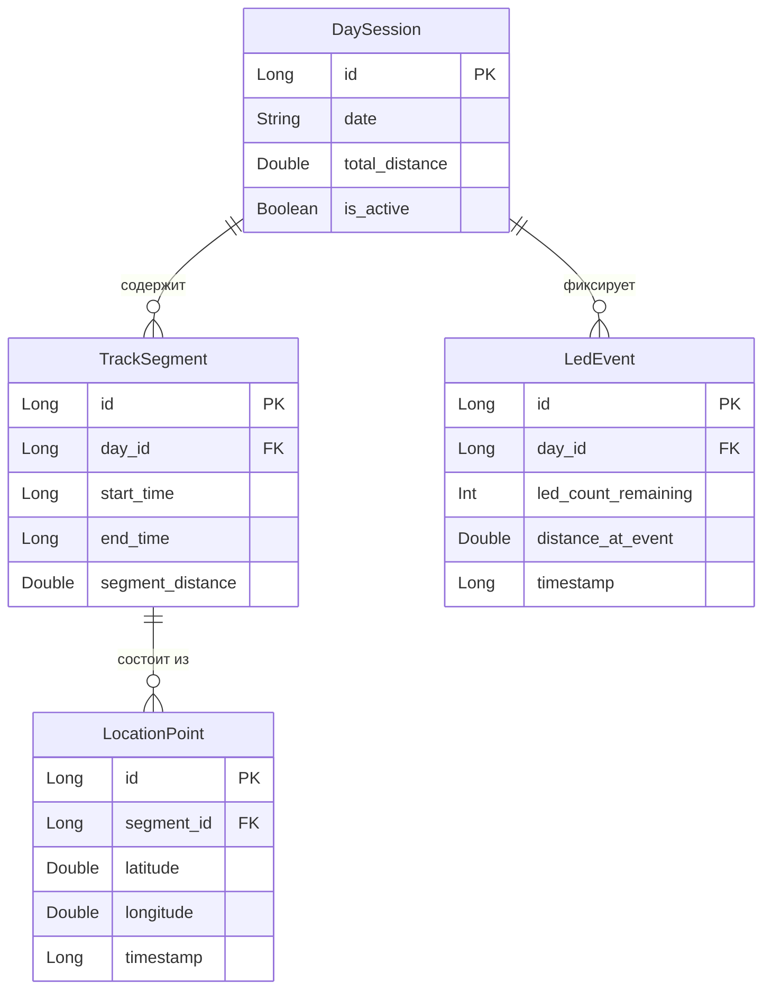
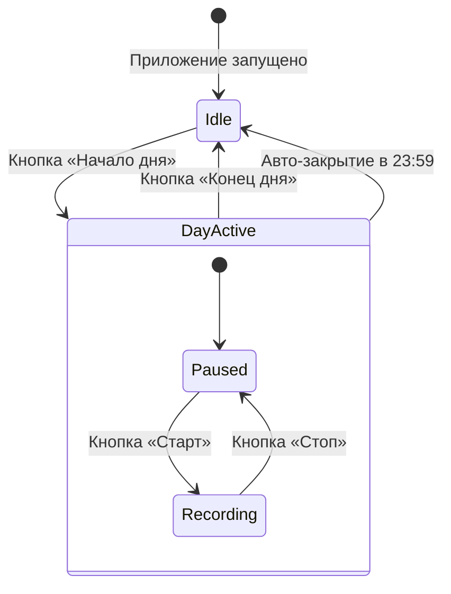
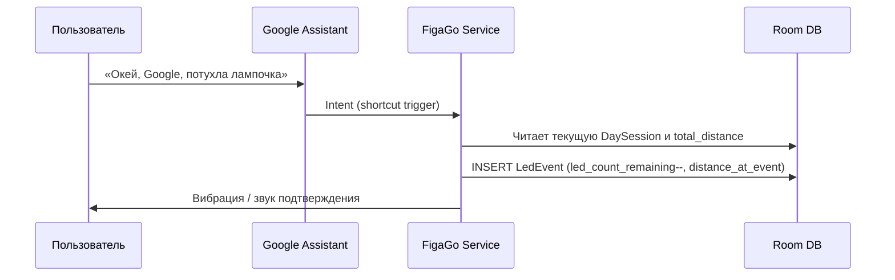
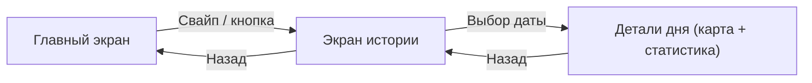

# Техническое задание: Android-приложение для трекинга перемещений

## 1. Общие сведения

| Параметр | Значение |
|---|---|
| **Платформа** | Android 14+ (целевая оптимизация под устройства с агрессивным энергосбережением) |
| **Основная задача** | Фоновая запись GPS-трека, подсчёт дистанции, сбор статистики расхода батареи на основе 5-ступенчатой индикации напряжения |
| **Управление** | Минималистичный интерфейс + голосовое управление фоновыми событиями через Gemini (Google Assistant) |

---

## 2. Архитектура и стек

| Компонент | Технология |
|---|---|
| **Язык** | Kotlin |
| **UI** | Jetpack Compose |
| **База данных** | Room (SQLite) — локальное хранение |
| **Геолокация** | `FusedLocationProviderClient`, приоритет `PRIORITY_BALANCED_POWER_ACCURACY` |
| **Фоновый режим** | Foreground Service с постоянным системным уведомлением (предотвращение выгрузки из памяти) |

---

## 3. Структура базы данных (Room)

### 3.1. Таблица `DaySession` (Суточная сессия)

| Поле | Тип | Описание |
|---|---|---|
| `id` | `Long` (PK, autoGenerate) | Уникальный идентификатор сессии |
| `date` | `String` / `LocalDate` | Дата сессии |
| `total_distance` | `Double` | Суммарная дистанция за день (метры) |
| `is_active` | `Boolean` | Флаг активности сессии |

### 3.2. Таблица `TrackSegment` (Отрезок пути внутри дня)

| Поле | Тип | Описание |
|---|---|---|
| `id` | `Long` (PK, autoGenerate) | Уникальный идентификатор отрезка |
| `day_id` | `Long` (FK → DaySession) | Ссылка на суточную сессию |
| `start_time` | `Long` / `Instant` | Время начала записи отрезка |
| `end_time` | `Long` / `Instant` | Время окончания записи отрезка |
| `segment_distance` | `Double` | Дистанция отрезка (метры) |

### 3.3. Таблица `LocationPoint` (Точки маршрута)

| Поле | Тип | Описание |
|---|---|---|
| `id` | `Long` (PK, autoGenerate) | Уникальный идентификатор точки |
| `segment_id` | `Long` (FK → TrackSegment) | Ссылка на отрезок пути |
| `latitude` | `Double` | Широта |
| `longitude` | `Double` | Долгота |
| `timestamp` | `Long` / `Instant` | Временная метка фиксации |

### 3.4. Таблица `LedEvent` (События падения напряжения)

| Поле | Тип | Описание |
|---|---|---|
| `id` | `Long` (PK, autoGenerate) | Уникальный идентификатор события |
| `day_id` | `Long` (FK → DaySession) | Ссылка на суточную сессию |
| `led_count_remaining` | `Int` | Оставшееся количество индикаторов (4, 3, 2, 1) |
| `distance_at_event` | `Double` | Дистанция с начала дня на момент погасания (метры) |
| `timestamp` | `Long` / `Instant` | Временная метка события |

### ER-диаграмма

---

## 4. Логика работы

### 4.1. Жизненный цикл дня

- **Кнопка «Начало дня»:**
  - Создание записи `DaySession` с текущей датой.
  - Сброс счётчика индикаторов до **5**.

- **Кнопка «Конец дня»:**
  - Авто-остановка активного трека (если запись идёт).
  - Закрытие сессии (`is_active = false`).

- **Автоматическое закрытие:**
  - Принудительное завершение `DaySession` в **23:59** для защиты от бесконечного фонового процесса.

### 4.2. Жизненный цикл трека

- Кнопки **«Старт»** и **«Стоп»** управляют записью координат.
- При нажатии «Старт» создаётся новая сущность `TrackSegment`.
- При нажатии «Стоп» текущий `TrackSegment` завершается (фиксируется `end_time` и `segment_distance`).

### 4.3. Фиксация батареи (LED-события)

- Отметка события **уменьшает** счётчик на 1 (5 → 4 → 3 → 2 → 1 → 0).
- При фиксации приложение записывает **текущий суммарный километраж** за день в поле `distance_at_event`.
- Накопленные исторические данные используются для вычисления **среднего пробега** на каждом из 5 интервалов разряда.

---

## 5. Голосовое управление (App Actions / Shortcuts)

### 5.1. Интеграция

- Использование файла `shortcuts.xml` для регистрации голосовых команд.

### 5.2. Триггер

- Голосовая команда, например: **«Окей, Google, потухла лампочка»**.

### 5.3. Действие в приложении

1. Перехват `Intent` фоновым сервисом **без активации экрана**.
2. Вычисление текущей дистанции.
3. Запись нового `LedEvent` в Room.
4. **Звуковое уведомление** или **короткая вибрация** для подтверждения успешной записи.

---

## 6. Пользовательский интерфейс (UI)

### 6.1. Главный экран

- **Крупные элементы управления** — минимизация ложных нажатий в движении.
- **Информационный блок:**
  - Текущее значение счётчика лампочек (визуальные индикаторы).
  - Пройденное расстояние за день (крупный шрифт).
  - Текущий статус: запись / пауза.
   **Блок карты:**
  - Google Maps SDK.
  - Центрирование на пользователе.
  - Отрисовка текущего `TrackSegment` с помощью `Polyline`.

### 6.2. Экран истории

- Список сохранённых дат.
- При выборе даты:
  - Карта со **всеми отрезками пути** за выбранный день.
  - **Маркеры** событий `LedEvent` на карте.
  - Общая статистика по дистанции.

### Навигация экранов

---

## 7. Нефункциональные требования

| Требование | Описание |
|---|---|
| **Энергоэффективность** | Минимальное влияние на заряд батареи; использование `PRIORITY_BALANCED_POWER_ACCURACY` |
| **Надёжность фонового режима** | Foreground Service с persistent notification; защита от kill'а системой |
| **Автозакрытие** | Принудительное завершение сессии в 23:59 |
| **Офлайн-работа** | Полностью автономная работа без интернета (кроме карт) |
| **Минимум взаимодействия** | Крупные кнопки, голосовое управление — для использования в движении |
