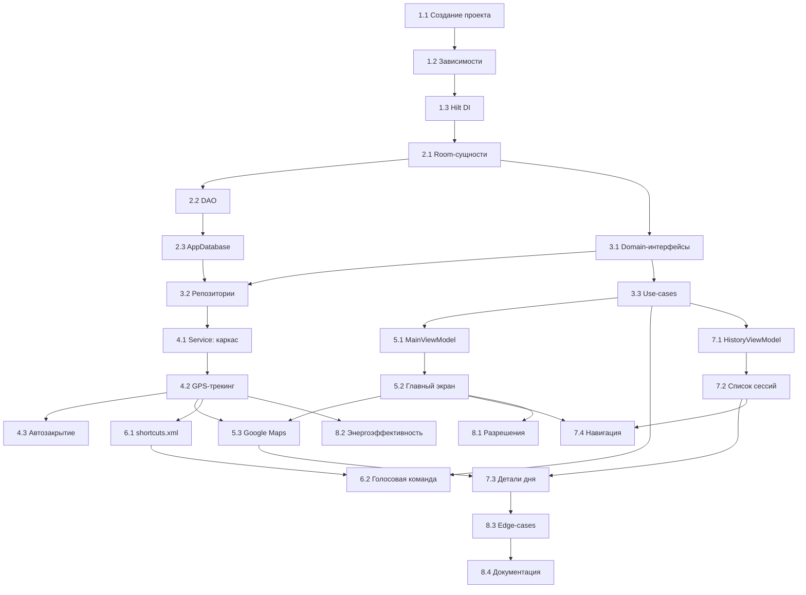

# FigaGo — План разработки (tasks.md)

> **Change:** `init-figago` — Инициализация и полная реализация Android-приложения FigaGo  
> **Стек:** Kotlin · Jetpack Compose · Room · Google Maps SDK · Google Assistant  
> **Архитектура:** MVVM + Clean Architecture

---

## Условные обозначения

| Символ | Значение |
|--------|----------|
| ⬜ | Не начата |
| 🔄 | В работе |
| ✅ | Завершена |
| 🔗 | Зависимость от другой задачи |

---

## Этап 1 — Инициализация проекта

### Задача 1.1 ✅ Создание Android-проекта (~1 ч)
- **Компоненты:** Gradle, project scaffolding
- **Зависимости:** нет
- **Описание:**
  - Создать проект в Android Studio (min SDK 26, target SDK 34+).
  - Настроить `build.gradle.kts`: подключить плагины `kotlin-kapt` / `ksp`, Compose, Room.
  - Структура пакетов по слоям Clean Architecture:
    ```
    com.figago
    ├── data/          # Room entities, DAO, Repository impl
    ├── domain/        # Use-cases, модели, интерфейсы репозиториев
    ├── service/       # Foreground Service
    ├── ui/            # Compose-экраны, ViewModels
    └── voice/         # App Actions / Shortcuts
    ```
- **Результат:** Проект компилируется, пустой `MainActivity` отображает пустой Compose-экран.

### Задача 1.2 ✅ Подключение зависимостей (~30 мин)
- **Компоненты:** Gradle
- **Зависимости:** 🔗 1.1
- **Описание:**
  - Room (runtime, compiler, ktx)
  - Jetpack Compose (BOM, material3, navigation)
  - Google Maps SDK + Compose-обёртка (`maps-compose`)
  - Google Location Services (`play-services-location`)
  - Lifecycle (viewmodel-compose, service)
  - Hilt (DI)
- **Результат:** Все зависимости синхронизированы, проект компилируется без ошибок.

### Задача 1.3 ✅ Настройка Hilt DI (~30 мин)
- **Компоненты:** DI, Application
- **Зависимости:** 🔗 1.2
- **Описание:**
  - Создать `FigaGoApplication` с аннотацией `@HiltAndroidApp`.
  - Создать базовый `AppModule` с провайдерами (пока пустой, заполним далее).
  - Зарегистрировать `Application` в `AndroidManifest.xml`.
- **Результат:** Hilt инициализируется при старте приложения.

---

## Этап 2 — Доменная модель и база данных (Room)

### Задача 2.1 ✅ Реализация Room-сущностей (~1 ч)
- **Компоненты:** `data/entity`
- **Зависимости:** 🔗 1.3
- **Описание:**
  - `DaySessionEntity` — суточная сессия (`id`, `date`, `total_distance`, `is_active`).
  - `TrackSegmentEntity` — отрезок пути (`id`, `day_id` FK, `start_time`, `end_time`, `segment_distance`).
  - `LocationPointEntity` — GPS-точка (`id`, `segment_id` FK, `latitude`, `longitude`, `timestamp`).
  - `LedEventEntity` — событие батареи (`id`, `day_id` FK, `led_count_remaining`, `distance_at_event`, `timestamp`).
  - Настроить `@ForeignKey`, `@Index` для внешних ключей.
- **Результат:** 4 Entity-класса, соответствующие ER-диаграмме из proposal.

### Задача 2.2 ✅ Реализация DAO-интерфейсов (~1.5 ч)
- **Компоненты:** `data/dao`
- **Зависимости:** 🔗 2.1
- **Описание:**
  - `DaySessionDao` — CRUD + `getActiveSession()`, `getSessionByDate()`, `closeSession()`.
  - `TrackSegmentDao` — CRUD + `getSegmentsByDayId()`, `getActiveSegment()`.
  - `LocationPointDao` — `insertPoint()`, `getPointsBySegmentId()`.
  - `LedEventDao` — `insertEvent()`, `getEventsByDayId()`, `getAllEvents()` (для статистики).
  - Все запросы возвращают `Flow<>` для реактивной подписки.
- **Результат:** 4 DAO-интерфейса, покрывающие все сценарии чтения/записи.

### Задача 2.3 ✅ Создание AppDatabase и миграций (~30 мин)
- **Компоненты:** `data/db`
- **Зависимости:** 🔗 2.2
- **Описание:**
  - `AppDatabase` — `@Database` с 4 сущностями, версия 1.
  - Провайдер `Room.databaseBuilder` в `AppModule` (Hilt).
  - Провайдеры для всех DAO.
- **Результат:** БД создаётся при первом запуске, DAO инжектируются через Hilt.

---

## Этап 3 — Репозитории и бизнес-логика (Domain / Data)

### Задача 3.1 ✅ Интерфейсы репозиториев (Domain) (~1 ч)
- **Компоненты:** `domain/repository`
- **Зависимости:** 🔗 2.1
- **Описание:**
  - `SessionRepository` — управление сессиями дня.
  - `TrackRepository` — управление сегментами и GPS-точками.
  - `LedEventRepository` — регистрация и получение LED-событий.
  - Доменные модели (data-классы без Room-аннотаций): `DaySession`, `TrackSegment`, `LocationPoint`, `LedEvent`.
  - Маппинг Entity ↔ Domain model.
- **Результат:** Чистые интерфейсы без зависимости от Room.

### Задача 3.2 ✅ Реализация репозиториев (Data) (~1.5 ч)
- **Компоненты:** `data/repository`
- **Зависимости:** 🔗 2.3, 🔗 3.1
- **Описание:**
  - `SessionRepositoryImpl` — делегирует в `DaySessionDao`.
  - `TrackRepositoryImpl` — делегирует в `TrackSegmentDao`, `LocationPointDao`.
  - `LedEventRepositoryImpl` — делегирует в `LedEventDao`.
  - Привязка через Hilt `@Binds`.
- **Результат:** Репозитории работают, данные сохраняются и читаются из Room.

### Задача 3.3 ✅ Use-cases (~1.5 ч)
- **Компоненты:** `domain/usecase`
- **Зависимости:** 🔗 3.1
- **Описание:**
  - `StartDayUseCase` — создание `DaySession`, сброс LED-счётчика.
  - `EndDayUseCase` — остановка записи, закрытие сессии.
  - `StartTrackUseCase` — создание нового `TrackSegment`.
  - `StopTrackUseCase` — завершение сегмента, пересчёт дистанции.
  - `RecordLedEventUseCase` — фиксация LED-события с текущей дистанцией.
  - `GetDayStatsUseCase` — агрегация статистики (дистанция, LED-события) за день.
  - `GetHistoryUseCase` — список всех сессий для экрана истории.
- **Результат:** 7 Use-case'ов, инкапсулирующих бизнес-логику.

---

## Этап 4 — Foreground Service и GPS-трекинг

### Задача 4.1 ✅ Foreground Service: каркас (~1.5 ч)
- **Компоненты:** `service/TrackingService`, `AndroidManifest.xml`
- **Зависимости:** 🔗 3.2
- **Описание:**
  - Создать `TrackingService` (extends `LifecycleService`, `@AndroidEntryPoint`).
  - Настроить persistent notification (канал, иконка, текст «FigaGo — запись трека»).
  - Команды через `Intent.action`: `ACTION_START`, `ACTION_STOP`, `ACTION_END_DAY`.
  - Разрешения в манифесте: `FOREGROUND_SERVICE`, `FOREGROUND_SERVICE_LOCATION`, `ACCESS_FINE_LOCATION`, `ACCESS_COARSE_LOCATION`, `POST_NOTIFICATIONS`.
- **Результат:** Сервис запускается, показывает уведомление, корректно останавливается.

### Задача 4.2 ✅ GPS-трекинг в сервисе (~2 ч)
- **Компоненты:** `service/TrackingService`, `data/repository`
- **Зависимости:** 🔗 4.1
- **Описание:**
  - Подключить `FusedLocationProviderClient` с `PRIORITY_BALANCED_POWER_ACCURACY`.
  - Интервал обновлений: ~10 сек (настраиваемый).
  - При получении точки:
    1. Сохранить `LocationPoint` в Room.
    2. Рассчитать дистанцию от предыдущей точки (`Location.distanceTo()`).
    3. Обновить `segment_distance` в `TrackSegment` и `total_distance` в `DaySession`.
  - Обновлять уведомление с текущей дистанцией.
- **Результат:** GPS-точки записываются в БД, дистанция пересчитывается в реальном времени.

### Задача 4.3 ✅ Автозакрытие сессии в 23:59 (~45 мин)
- **Компоненты:** `service/TrackingService`
- **Зависимости:** 🔗 4.2
- **Описание:**
  - При старте `DaySession` запланировать `AlarmManager` или использовать Handler/coroutine delay до 23:59.
  - По таймауту — вызвать `EndDayUseCase`, остановить запись, закрыть сервис.
- **Результат:** Сессия автоматически закрывается в конце суток.

---

## Этап 5 — UI: Главный экран

### Задача 5.1 ✅ MainViewModel (~1.5 ч)
- **Компоненты:** `ui/main/MainViewModel`
- **Зависимости:** 🔗 3.3
- **Описание:**
  - `StateFlow<MainUiState>` — текущее состояние (Idle / DayActive / Recording / Paused).
  - Текущая дистанция (`total_distance`), оставшиеся лампочки (`ledCount`).
  - Методы: `startDay()`, `endDay()`, `startTrack()`, `stopTrack()`, `recordLedEvent()`.
  - Подписка на `Flow` из репозиториев для реактивного обновления UI.
- **Результат:** ViewModel управляет всеми состояниями главного экрана.

### Задача 5.2 ✅ Compose: главный экран — панель управления (~2 ч)
- **Компоненты:** `ui/main/MainScreen`
- **Зависимости:** 🔗 5.1
- **Описание:**
  - **Крупные кнопки** (минимум 64dp touch target):
    - «Начало дня» / «Конец дня» — меняются по состоянию.
    - «Старт» / «Стоп» записи трека.
    - «Лампочка погасла» — фиксация LED-события.
  - **Информационный блок:**
    - Индикатор лампочек (5 кругов: заполненные/пустые).
    - Пройденная дистанция крупным шрифтом (км / м).
    - Статус: «Запись» / «Пауза» / «Неактивно».
  - Тёмная тема по умолчанию, крупные контрастные элементы.
- **Результат:** Полностью функциональная панель управления.

### Задача 5.3 ✅ Compose: интеграция Google Maps (~2 ч)
- **Компоненты:** `ui/main/MainScreen`, `ui/components/MapView`
- **Зависимости:** 🔗 5.2, 🔗 4.2
- **Описание:**
  - Подключить Google Maps API Key (через `local.properties` / `secrets-gradle-plugin`).
  - Отобразить карту (`GoogleMap` composable из `maps-compose`).
  - Центрирование на текущей позиции пользователя.
  - Отрисовка активного `TrackSegment` как `Polyline`.
  - Реактивное обновление полилинии при поступлении новых точек.
- **Результат:** Карта показывает текущий трек в реальном времени.

---

## Этап 6 — Голосовое управление (App Actions)

### Задача 6.1 ✅ Настройка shortcuts.xml (~1 ч)
- **Компоненты:** `voice/`, `res/xml/shortcuts.xml`, `AndroidManifest.xml`
- **Зависимости:** 🔗 4.2
- **Описание:**
  - Создать `res/xml/shortcuts.xml` с определением App Action.
  - Зарегистрировать capability для голосовой команды (BII или custom intent).
  - Фраза-триггер: «потухла лампочка» (и варианты).
  - Указать `<intent>` на `TrackingService` или dedicated `BroadcastReceiver`.
- **Результат:** Google Assistant распознаёт команду и отправляет Intent.

### Задача 6.2 ✅ Обработка голосовой команды в сервисе (~1.5 ч)
- **Компоненты:** `service/TrackingService` или `voice/VoiceBroadcastReceiver`
- **Зависимости:** 🔗 6.1, 🔗 3.3
- **Описание:**
  - Перехват `Intent` от Google Assistant.
  - Вызов `RecordLedEventUseCase`:
    1. Прочитать текущую `DaySession` и `total_distance`.
    2. Уменьшить `led_count_remaining` на 1.
    3. Сохранить `LedEvent` в Room.
  - Обратная связь: короткая вибрация (200мс) + звуковой тон.
  - Работа **без активации экрана**.
- **Результат:** Голосовая команда фиксирует LED-событие в фоне.

---

## Этап 7 — UI: Экран истории

### Задача 7.1 ✅ HistoryViewModel (~1 ч)
- **Компоненты:** `ui/history/HistoryViewModel`
- **Зависимости:** 🔗 3.3
- **Описание:**
  - `StateFlow<List<DaySession>>` — список всех сессий, отсортированных по дате (новые сверху).
  - При выборе сессии — загрузка деталей: сегменты, точки, LED-события.
  - `StateFlow<DayDetail>` — детали выбранного дня для экрана деталей.
- **Результат:** ViewModel для навигации по истории.

### Задача 7.2 ✅ Compose: список сессий (~1 ч)
- **Компоненты:** `ui/history/HistoryScreen`
- **Зависимости:** 🔗 7.1
- **Описание:**
  - `LazyColumn` со списком дат.
  - Каждый элемент: дата, суммарная дистанция, количество LED-событий.
  - Навигация при клике → экран деталей дня.
- **Результат:** Пользователь видит историю поездок.

### Задача 7.3 ✅ Compose: детали дня (карта + статистика) (~2 ч)
- **Компоненты:** `ui/history/DayDetailScreen`
- **Зависимости:** 🔗 7.2, 🔗 5.3
- **Описание:**
  - Карта с **всеми** `TrackSegment` за выбранный день (разные полилинии).
  - **Маркеры** `LedEvent` на карте (иконка лампочки с номером).
  - Панель статистики:
    - Общая дистанция за день.
    - Количество сегментов.
    - Время в движении.
    - Средний пробег между LED-событиями (историческое среднее).
- **Результат:** Полная детализация любого дня из истории.

### Задача 7.4 ✅ Навигация между экранами (~45 мин)
- **Компоненты:** `ui/navigation/`
- **Зависимости:** 🔗 5.2, 🔗 7.2
- **Описание:**
  - `NavHost` с тремя маршрутами: `main`, `history`, `day_detail/{dayId}`.
  - Анимации переходов (slide / fade).
  - Bottom navigation или swipe-жест для переключения Main ↔ History.
- **Результат:** Плавная навигация между всеми экранами приложения.

---

## Этап 8 — Финализация и отладка

### Задача 8.1 ✅ Запрос Runtime-разрешений (~1 ч)
- **Компоненты:** `ui/main/MainScreen`, `ui/permissions/`
- **Зависимости:** 🔗 5.2
- **Описание:**
  - Запрос `ACCESS_FINE_LOCATION`, `ACCESS_COARSE_LOCATION` при первом запуске.
  - Для Android 13+ — запрос `POST_NOTIFICATIONS`.
  - Для Android 14+ — запрос `FOREGROUND_SERVICE_LOCATION`.
  - Обработка отказа: информативный диалог с объяснением, почему нужно разрешение.
- **Результат:** Приложение корректно запрашивает все необходимые разрешения.

### Задача 8.2 ⬜ Тестирование энергоэффективности (~1.5 ч)
- **Компоненты:** `service/TrackingService`
- **Зависимости:** 🔗 4.2
- **Описание:**
  - Проверка на устройствах с агрессивным Doze (Samsung, Xiaomi, Huawei).
  - Убедиться, что Foreground Service не убивается системой.
  - Проверить расход батареи при многочасовой записи.
  - При необходимости — настроить `REQUEST_IGNORE_BATTERY_OPTIMIZATIONS`.
- **Результат:** Стабильная фоновая работа сервиса на целевых устройствах.

### Задача 8.3 ✅ Обработка edge-cases (~1.5 ч)
- **Компоненты:** Все слои
- **Зависимости:** 🔗 все предыдущие задачи
- **Описание:**
  - Потеря GPS-сигнала (тоннель, здание) — не записывать «прыжки».
  - Повторное открытие приложения при активной сессии — восстановление состояния.
  - Попытка «Начало дня» при уже активной сессии — предупреждение.
  - LED-счётчик = 0 — блокировка дальнейшей регистрации с уведомлением.
- **Результат:** Приложение корректно обрабатывает все граничные ситуации.

### Задача 8.4 ✅ Документация и README (~1 ч)
- **Компоненты:** документация
- **Зависимости:** 🔗 все предыдущие задачи
- **Описание:**
  - README.md: описание проекта, скриншоты, инструкция сборки.
  - Комментарии ко всем публичным API (KDoc).
  - Описание архитектуры в `/docs/architecture.md`.
- **Результат:** Проект задокументирован и готов к передаче.

---

## Граф зависимостей



---

## Сводка

| Этап | Задач | Общая оценка |
|------|-------|-------------|
| 1 — Инициализация проекта | 3 | ~2 ч |
| 2 — Room DB | 3 | ~3 ч |
| 3 — Репозитории и бизнес-логика | 3 | ~4 ч |
| 4 — Foreground Service + GPS | 3 | ~4.25 ч |
| 5 — UI: Главный экран | 3 | ~5.5 ч |
| 6 — Голосовое управление | 2 | ~2.5 ч |
| 7 — UI: Экран истории | 4 | ~4.75 ч |
| 8 — Финализация | 4 | ~5 ч |
| **Итого** | **25** | **~31 ч** |
